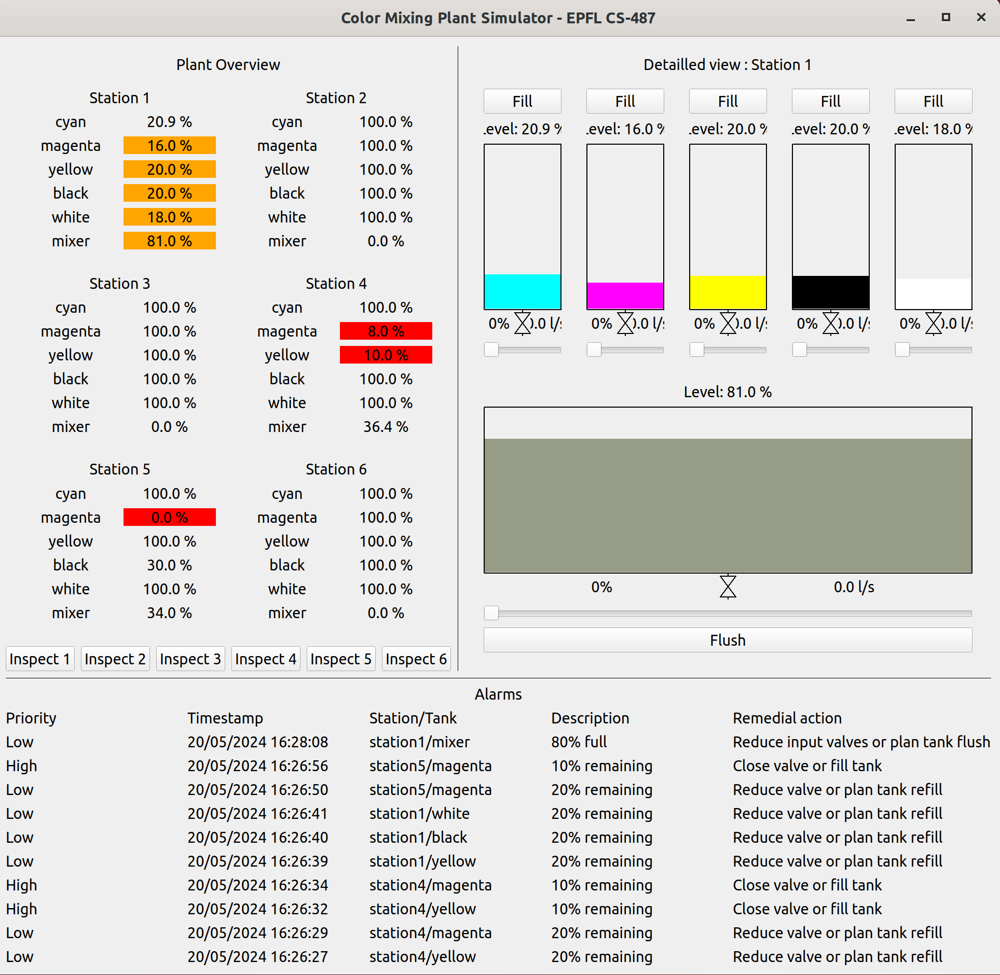

# EPFL Industrial Automation Lecture (CS-487)
This repository contains sample code for the group project of the [Industrial Automation (CS-487)](https://edu.epfl.ch/coursebook/en/industrial-automation-CS-487) lecture at EPFL.

## Introduction
The project considers a paint production plant. A paint mixing station is composed of 5 paint tanks with unique colors (cyan, magenta, yellow, black and white color) and one mixing tank, as shown in the screenshot below. Each paint tank is controlled via an output valve, and the mixing tank can be emptied via a dedicated pump and output valve. Each tank has a level sensor measuring the level of the paint inside in a tank, as well as a flow meter measuring the paint outflow.



## Requirements
* Python 3.7 or higher
* [PyTango](https://pytango.readthedocs.io/)
* [Mixbox](https://github.com/scrtwpns/mixbox)
* [PyQt5](https://pypi.org/project/PyQt5/)

Install the requirements using pip:  
```
pip install -r requirements.txt
```

## User Guide

### Paint Mixing Station Simulator
The `simulator.py` file contains a Python-based simulator for a paint mixing station as described above. For each time interval, the simulator calculates the paint level and outgoing flow for each paint tank and the mixing tank based on the setting of the corresponding valve.

The stand-alone version of the simulator can be started as follows:  
`python simulator.py`

### Tango Device Server
The `PaintMixingStation.py` contains skeleton code for a [Tango](https://www.tango-controls.org/) device server instance. It implements the `TankDevice` device server class representing each tank as a separate device instance. Furthermore, the device server creates an instance of the simulator.

**Please note that the device server code only provides a dummy implementation of device attributes and commands. The goal of the project work is to link the device server attributes and commands with the simulation of the paint mixing station.**

The implementation assumes that the devices in Tango are named as follows: `epfl/<station_name>/<tank_name>` (for example: `epfl/station1/cyan`). If the naming scheme is different, then the mapping between device name and tank name in the simulator needs to be modified accordingly in the `init_device()` method of the device server class.

The device server instance for Tango can be started as follows:  
`python PaintMixingStation.py <station_name>`

Note: The device server needs to be registered with Tango before it can be used. This can be achieved using the `Jive` tool provided by Tango or using the `register-server.py` script in this repository:  
`register-server.py <station_name>`

### Graphical User Interface (GUI)
The user interface can be used to visualize the current state of the paint mixing station. It connects as a client to Tango and is polling attributes and sending commands to/from the device server. The client assumes that the Tango attributes and commands are named according to the following scheme: `epfl/<station_name>/<tank_name>/<attribute_or_command_name>` (example: `epfl/station1/cyan/level`). To use the GUI with a different naming scheme, the global variables `TANGO_NAME_PREFIX`, `TANGO_ATTRIBUTE_*` and `TANGO_COMMAND_*` need to be modified accordingly.

The GUI can be started as follows:  
`python gui.py`
